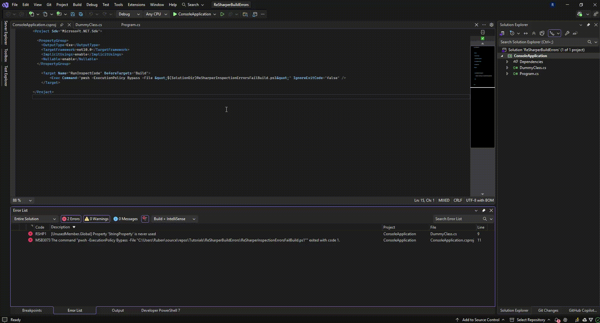
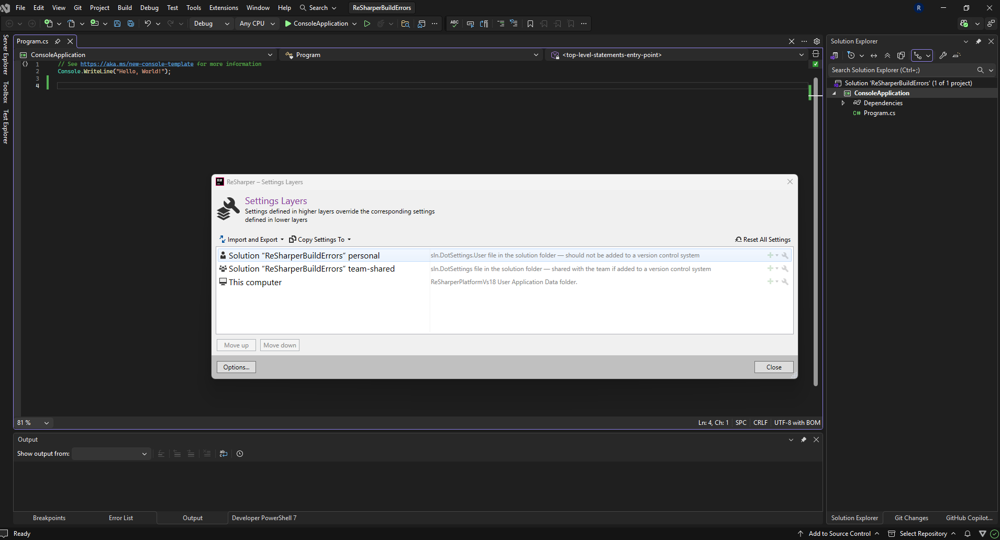
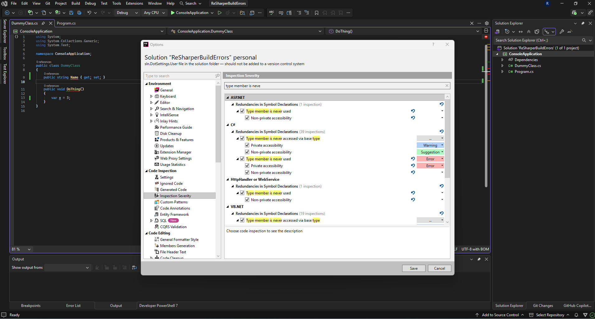
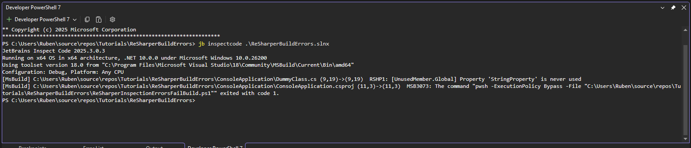

## Table of contents

## TLDR

This is the end result. You can download the source code [here](https://github.com/RubenHeeren/ReSharperBuildErrors).



## Introduction

I wrote this blog post because I wanted to set some ReSharper intellisense suggestions as errors instead of warnings, and also have the build fail on that.

Because if it's only in the intellisense, people can just ignore it. Sadly out of the box, if you set ReSharper intellisense suggestions as errors, there's no setting to say 'make the build fail also'. The solution I came up with is to use the ReSharper command line, parse the results to a file, and read the contents of that file with a PowerShell script.

## Versions
I wrote this tutorial for Windows 11, using ReSharper version 2025.3.0.1 and Visual Studio 2026 18.0.2. I can confirm it also works on Visual Studio 2022. I'll be using PowerShell 7 but should work fine on older PowerShell versions.

## So how to do it?

Install ReSharper on Visual Studio if you haven't yet. I created a .NET 10 console application to showcase how to do this, but it should work for any project type. First of all open the ReSharper Settings Layers screen via Extensions -> ReSharper -> Manage Options.


You'll be presented with this screen:


> [!NOTE]
> ReSharper exposes settings in layers, in that way you can have overrides. To learn more about that, see [this ReSharper documentation article](https://www.jetbrains.com/help/resharper/Sharing_Configuration_Options.html). 

In this tutorial I'll modify the personal layer at the top. You can modify the settings of a layer by clicking on the little wrench.

To have a ReSharper code inspection show up as error you can go to Code Inspection -> Inspection Severity -> C#.



An easy example is 'Type member is never used' so I'll change the severity level of that to Error and click Save.

Then if we create a dummy class with a property, we'll see the error show up. We see a red squiggly line below it.

But if we build the project, it will still work.

Sadly, as far as I know there's no option for this in ReSharper.

So to solve this we can run the ReSharper CLI and output the analysis to a file, then parse the errors to that file and feed it to the build in a prebuild action.

Let's start by installing the ReSharper CLI. [Docs link](https://www.jetbrains.com/help/resharper/ReSharper_Command_Line_Tools.html).

I used this command in PowerShell 7:

`dotnet tool install -g JetBrains.ReSharper.GlobalTools`

You can verify that it works by running the following command from the solution folder:

**Visual Studio 2022**

`jb inspectcode .\SolutionName.sln`

**Visual Studio 2026**

`jb inspectcode .\SolutionName.slnx`

When I ran that i got this output:



So now we can add the PowerShell script to automate this process before each build. The script below will run jb inspectcode, output the results to `inspect.sarif.json`, parse that file for errors and list them as clickable errors in Visual Studio.

Go ahead and save this as a PowerShell script in your solution root.

```powershell showlinenumbers  title="ReSharperInspectionErrorsFailBuild.ps1"
param(
    # Where to write the SARIF file (relative to THIS SCRIPT'S folder)
    [string]$SarifPath    = "inspect.sarif.json",
    [string]$InspectCode  = "jb" # or full path to inspectcode.exe / inspectcode.cmd
)

# Resolve script directory (NOT current working directory)
$ScriptDir = Split-Path -Parent $MyInvocation.MyCommand.Path

# Auto-detect .sln / .slnx in script directory
$solutionFiles = Get-ChildItem -Path $ScriptDir -File |
    Where-Object { $_.Extension -in '.sln', '.slnx' }

if ($solutionFiles.Count -eq 0) {
    throw "No .sln or .slnx file found in script folder: $ScriptDir"
}
elseif ($solutionFiles.Count -gt 1) {
    $names = $solutionFiles.Name -join ', '
    throw "Multiple .sln/.slnx files found in $ScriptDir $names. " +
          "Currently this script does not support selecting one; " +
          "please keep only a single solution file next to the script."
}

$SolutionFull = $solutionFiles[0].FullName

# SARIF path relative to script folder if not rooted
if (-not [System.IO.Path]::IsPathRooted($SarifPath)) {
    $SarifFull = Join-Path $ScriptDir $SarifPath
}
else {
    $SarifFull = $SarifPath
}

Write-Host "Script directory: $ScriptDir"
Write-Host "Solution path   : $SolutionFull"
Write-Host "SARIF path      : $SarifFull"

# 1. Run InspectCode with SARIF output (NO BUILD)
Write-Host "Running ReSharper InspectCode on $SolutionFull ..."
& $InspectCode inspectcode $SolutionFull `
    --no-build `
    --format=Sarif `
    --output="$SarifFull" `
    --verbosity=OFF

if ($LASTEXITCODE -ne 0) {
    Write-Error "inspectcode failed to run (exit code $LASTEXITCODE)."
    exit $LASTEXITCODE
}

if (!(Test-Path $SarifFull)) {
    Write-Error "SARIF output file not found: $SarifFull"
    exit 1
}

# 2. Load SARIF
Write-Host "Loading SARIF from $SarifFull ..."
$json    = Get-Content $SarifFull -Raw | ConvertFrom-Json
$results = $json.runs[0].results

if (-not $results) {
    Write-Host "ReSharper InspectCode: no issues found."
    exit 0
}

# 3. Filter only errors, excluding unresolved symbol CSharpErrors
$errors = $results | Where-Object {
    $_.level -eq "error" -and $_.ruleId -ne ".CSharpErrors"
}

if (-not $errors -or $errors.Count -eq 0) {
    Write-Host "ReSharper InspectCode: no errors found (only notes/warnings)."
    exit 0
}

Write-Host ""
Write-Host "Build failed because of ReSharper errors:"
Write-Host ""

$solutionDir = Split-Path $SolutionFull -Parent
$index = 1

foreach ($e in $errors) {
    $ruleId  = $e.ruleId
    $message = $e.message.text

    $loc  = $e.locations[0].physicalLocation
    $uri  = $loc.artifactLocation.uri   # e.g. "RelyonAdmin/Models/PropertyNode.cs"
    $line = $loc.region.startLine
    $col  = $loc.region.startColumn

    # Normalize URI -> Windows path, then make absolute
    $relPath  = $uri -replace '/', '\'
    $fileFull = Join-Path $solutionDir $relPath

    # Human-readable summary (optional)
    
    # MSBuild/VS-friendly error line on STDOUT, **not** Write-Error:
    # path(line,col): error CODE: [RuleId] message
    $errorCode = "RSHP$index"
    $msbuildLine = ("{0}({1},{2}): error {3}: [{4}] {5}" -f `
        $fileFull, $line, $col, $errorCode, $ruleId, $message)

    Write-Host $msbuildLine

    $index++
}

exit 1
```

Once completed, add this to the csproj you're running for your application.

`pwsh` is for PowerShell 7. You might need to change this if you're using an earlier version.

This is my full .csproj for a basic console application:

```xml showlinenumbers  title="ConsoleApplication.csproj"
<Project Sdk="Microsoft.NET.Sdk">

  <PropertyGroup>
    <OutputType>Exe</OutputType>
    <TargetFramework>net10.0</TargetFramework>
    <ImplicitUsings>enable</ImplicitUsings>
    <Nullable>enable</Nullable>
  </PropertyGroup>

	<Target Name="RunInspectCode" BeforeTargets="Build">
		<Exec Command="pwsh -ExecutionPolicy Bypass -File &quot;$(SolutionDir)ReSharperInspectionErrorsFailBuild.ps1&quot;" IgnoreExitCode="false" />
	</Target>

</Project>
```

This is the result:


There you go. This is a basic implementation to make your build errors fail on ReSharper inspections with Error severity.

You can download the [source code](https://github.com/RubenHeeren/ReSharperBuildErrors) here.